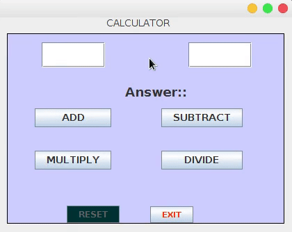

## Simple calculator using Java Swing GUI!!
Knowing how Swing works...you never know how interesting it could get!!!

# What you'll learn:
```
You will learn about different aspects of java aside from just the basics, like how to give your java 
applications a Graphical User Interface (GUI) to make it more user friendly.

You will also learn how to use the .getText(), .setText(), etc. commands and which are necessary for programming a GUI.

Add to you're understanding of classes as you import new ones.

Lastly, you will learn more about the use of constructors and how to call one.
```
### Here's how this Java Swing App Works:-
<p align="center">
     <br>
    </p>

### Learn the basics to understand the rest ;-) ...

### Do you like it ?
Don't forget to Star and Watch the repo 

## Contributing
Feel free to contribute .. :D

1. Fork it!
2. Commit.
3. Push.
5. Submit a pull request. :)

## Requests, Improvements, Issues

If you found a mistake, or you find improvements are needed feel free to submit 
[**a new issue**](https://github.com/siddhartthecoder/Calculator-using-Java-Swing/issues).
>>>>>>> made changes to README.md
